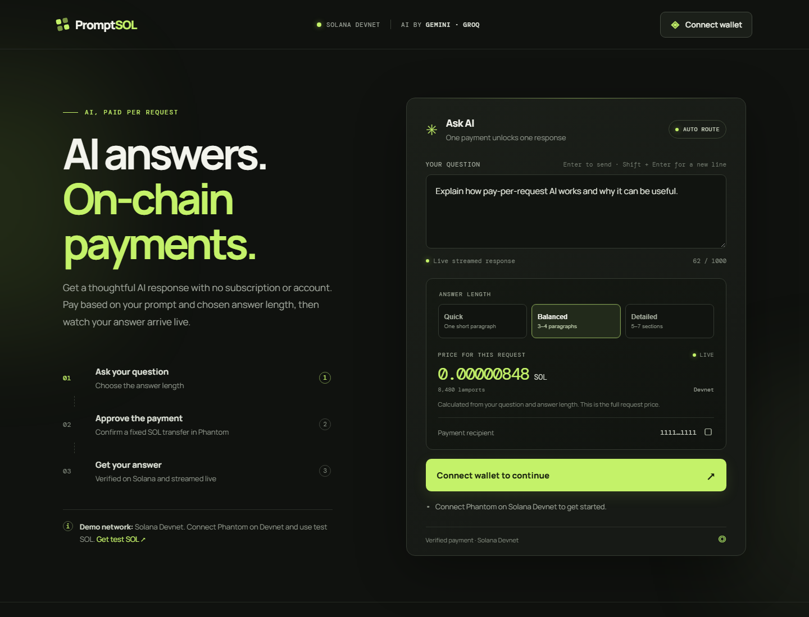
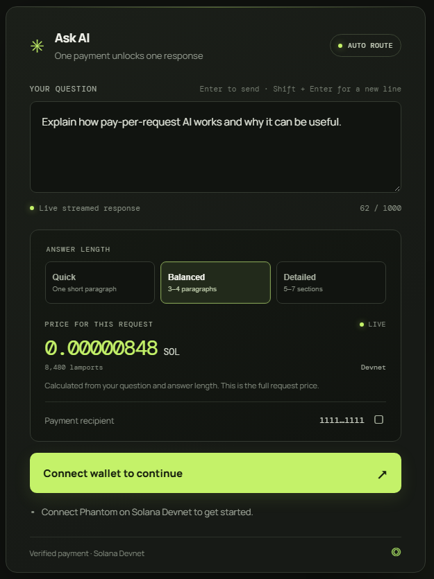
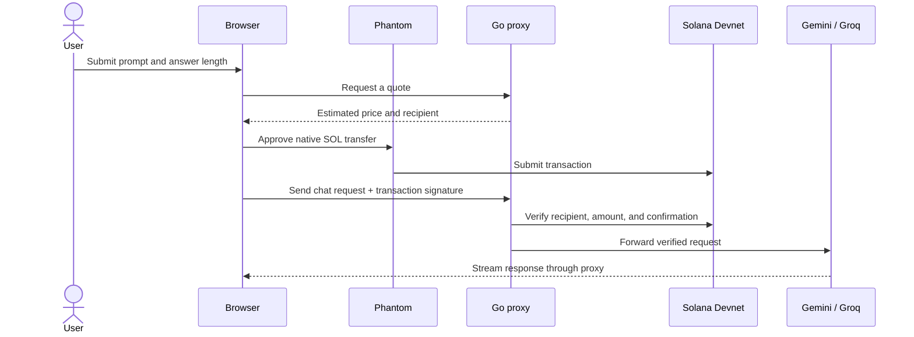

<p align="center">
  
</p>

<h1 align="center">PromptSOL</h1>
<h3 align="center">One prompt. One payment. One AI answer.</h3>

<p align="center">Pay-per-request AI on Solana.</p>

<p align="center">
  
  
  
  
</p>

<p align="center">
  <a href="#demo-video">▶ Demo video</a>
  &nbsp;·&nbsp;
  <a href="#pitch-video">▶ Pitch video</a>
  &nbsp;·&nbsp;
  <a href="#run-it-locally">Run it locally</a>
</p>

<p align="center">
  
</p>

<details>
  <summary>See the payment card up close</summary>
  <p align="center"></p>
</details>

## One question shouldn’t require a subscription

PromptSOL explores a simple idea: let someone pay for the AI response they need, one request at a time. The user sees an estimated price, approves a single SOL transfer in Phantom, and gets a streamed answer.

## From prompt to answer

| 1 · Ask | 2 · Review | 3 · Approve | 4 · Receive |
|---|---|---|---|
| Enter a question and choose Quick, Balanced, or Detailed. | See the estimated price before opening the wallet. | Confirm the native SOL transfer in Phantom on Devnet. | The proxy verifies payment, then streams the AI response. |

Groq is the primary provider when `GROQ_API_KEY` is configured. Gemini remains available as a fallback, so PromptSOL can switch providers using the same confirmed payment. Without a Groq key, Gemini is used directly.

## Why this approach

- **No subscription for a one-off question.** Each request has its own quote and payment.
- **The price is visible first.** The estimate updates with the prompt and selected answer length.
- **The user chooses response depth.** Quick, Balanced, and Detailed set distinct output budgets.

> **MVP scope:** Devnet and test SOL only. Token counts are estimates, and the selected output allowance is charged upfront. PromptSOL uses a custom HTTP 402 payment flow; it is not yet a full implementation of the x402 protocol.

## Demo video

Demo video link will be added here.

## Pitch video

Pitch video link will be added here.

## Run it locally

You’ll need Docker Desktop, a Phantom wallet set to Solana Devnet, a Devnet recipient address, and a Gemini API key. Groq is recommended as the primary provider; Gemini is the fallback.

1. Copy `.env.example` to `.env`.
2. Set `SOLANA_WALLET_ADDRESS` and `UPSTREAM_API_KEY`. Optionally set `GROQ_API_KEY`.
3. Start the proxy:

   ```sh
   docker compose up --build -d proxy
   ```

4. Open [http://localhost:8080](http://localhost:8080), connect Phantom, and try a prompt. Use Devnet test SOL only.

## For technical reviewers

<details>
  <summary>Architecture, pricing, API, and project limits</summary>

### Request flow



### Pricing model

The quote estimates input tokens from request size and adds the chosen output allowance. Default rates are 2,000 lamports per 1,000 estimated input tokens and 8,000 lamports per 1,000 output tokens, with a 1,000-lamport minimum. The full quote is paid upfront, even if the response is shorter than the allowance. The estimate is character-based, not the provider’s exact tokenizer.

| Mode | Approximate response | Output allowance |
|---|---:|---:|
| Quick | 70–100 words | 384 tokens |
| Balanced | 200–300 words | 1,024 tokens |
| Detailed | 450–650 words | 2,048 tokens |

### HTTP API

| Method | Endpoint | Purpose |
|---|---|---|
| `GET` | `/api/payment-info` | Returns the recipient and minimum charge. |
| `POST` | `/api/quote` | Estimates the price before payment. |
| `POST` | `/v1/chat/completions` | Verifies payment and streams the AI response. |
| `GET` | `/` | Serves the browser app. |

Paid chat requests include `X-Payment-Signature`. The proxy verifies the confirmed transfer and rejects signatures already used by the running process.

### Current limits and next steps

- Devnet only; no mainnet payment flow.
- Payment-signature replay protection is in memory and resets when the process restarts.
- No refund or partial settlement if generation uses less than the selected output allowance.
- The custom 402 flow is not canonical x402 yet.
- Next: persistent payment records, model-aware token counting, and focused payment/fallback tests.

### Configuration

| Variable | Required | Purpose |
|---|:---:|---|
| `SOLANA_WALLET_ADDRESS` | Yes | Devnet payment recipient. |
| `UPSTREAM_API_KEY` | Yes | Gemini API key, used as fallback when Groq is configured. |
| `GEMINI_MODEL` | No | Gemini fallback model. Defaults to `gemini-3.8-flash`. |
| `GROQ_API_KEY` | No | Enables Groq as the primary provider; without it, Gemini is primary. |
| `GROQ_MODEL` | No | Groq model. Defaults to `openai/gpt-oss-20b`. |
| `PAYMENT_LAMPORTS` | No | Minimum request charge. |
| `INPUT_LAMPORTS_PER_1K_TOKENS` | No | Estimated input rate. |
| `OUTPUT_LAMPORTS_PER_1K_TOKENS` | No | Output allowance rate. |
| `SOLANA_RPC_URL` | No | Solana transaction verification endpoint. |

See [`.env.example`](.env.example) for defaults and all options. Never commit `.env`, wallet keypairs, or API keys.

### Project map

```text
cmd/proxy/       Go HTTP server and embedded browser app
internal/        Configuration, quotes, payment checks, and provider routing
assets/          README screenshots and logo
demo/            Optional command-line demo client
```

Read the [architecture notes](docs/ARCHITECTURE.md), [security notes](docs/SECURITY.md), and [contribution guide](CONTRIBUTING.md). The Go packages compile, but there are currently no dedicated Go unit-test files.

</details>

---

<p align="center"><strong>PromptSOL — pay for the answer you need.</strong></p>
