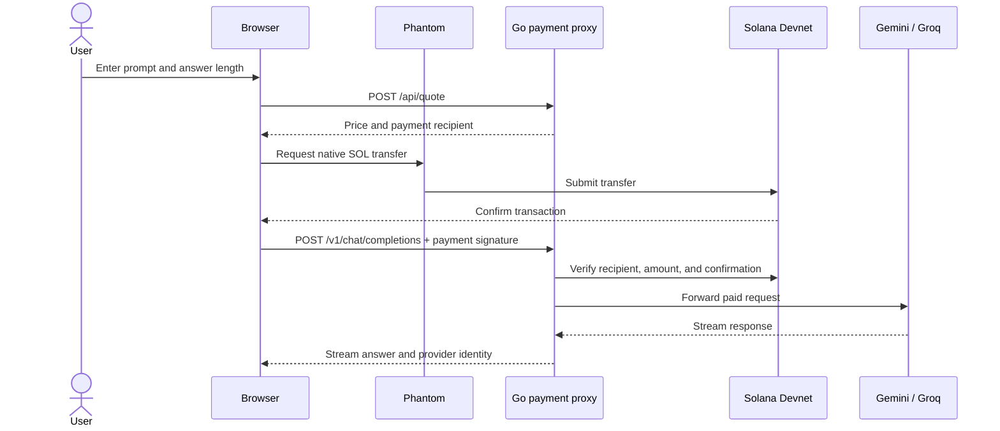

<p align="center">
  
</p>

<h1 align="center">Solana x402 AI Proxy</h1>
<h3 align="center">Pay per request. Get a useful AI answer.</h3>

<p align="center">
  A payment-gated AI proxy built with Go and Solana. Connect Phantom, get a clear quote, and watch Gemini or Groq stream an answer.
</p>

<p align="center">
  
  
  
  
</p>

<p align="center">
  <a href="#demo-video">▶ Demo video</a>
  &nbsp;·&nbsp;
  <a href="#pitch-video">▶ Pitch video</a>
</p>

<p align="center">
  <a href="#features">Features</a> ·
  <a href="#screenshots">Screenshots</a> ·
  <a href="#how-it-works">How it works</a> ·
  <a href="docs/ARCHITECTURE.md">Architecture</a> ·
  <a href="CONTRIBUTING.md">Contributing</a>
</p>

---

> **Protocol status:** This MVP uses a custom Solana payment flow with HTTP `402` and an `X-Payment-Signature` header. It is **not yet a full implementation of the x402 protocol**; the name describes the product direction.

## Screenshots

<p align="center">
  
</p>

<p align="center">
  
</p>

## Demo video

Demo video link will be added here.

## Pitch video

Pitch video link will be added here.

## The idea

AI tools often put a subscription between a person and a single answer. Solana x402 AI Proxy explores a smaller transaction: ask one question, approve one transparent Devnet payment, and receive one streamed response.

The proxy verifies the on-chain transfer before it contacts an AI provider. If Gemini is rate-limited or unavailable, it can retry with Groq using the same confirmed payment.

## Features

- **Pay per request:** connect a Phantom wallet on Solana Devnet and approve a native SOL transfer.
- **See the price first:** the quote updates as the prompt or answer length changes.
- **Choose response depth:** Quick, Balanced, or Detailed.
- **Watch answers stream live:** the browser identifies the provider that actually responded.
- **Retry after provider errors:** a confirmed payment can be reused for a retry.
- **Keep the gateway provider-flexible:** Gemini is the primary OpenAI-compatible endpoint; Groq is an optional fallback.

## How it works



Requests sent to `/v1/chat/completions` without a payment signature receive HTTP `402`. The browser app obtains a quote first so the user can see the amount before opening Phantom.

## Pricing

The MVP reserves the selected maximum answer length before generation. The final transfer amount is based on an estimate of the prompt plus that output allowance; the user pays that quoted amount even if the model returns a shorter answer.

| Answer option | Approximate response target | Output allowance |
|---|---:|---:|
| Quick | 70–100 words | 384 tokens |
| Balanced | 200–300 words | 1,024 tokens |
| Detailed | 450–650 words | 2,048 tokens |

Default rates are 2,000 lamports per 1,000 estimated input tokens and 8,000 lamports per 1,000 output tokens, with a 1,000-lamport minimum. The current estimator uses a conservative character-based approximation, not the provider's exact tokenizer. Rates and minimum are configurable in `.env`.

## Quick start

### Requirements

- Docker Desktop with Docker Compose
- Phantom wallet configured for Solana Devnet
- A Gemini API key
- A valid Solana Devnet recipient address

Groq is optional. Add a Groq API key to enable fallback.

### Run the proxy

1. Copy `.env.example` to `.env`.
2. Set `SOLANA_WALLET_ADDRESS` and `UPSTREAM_API_KEY`. Optionally set `GROQ_API_KEY`.
3. Build and start the app:

   ```sh
   docker compose up --build -d proxy
   ```

4. Open [http://localhost:8080](http://localhost:8080), connect Phantom on Devnet, and ask a question.

To follow the proxy logs:

```sh
docker compose logs -f proxy
```

Use Devnet test SOL only. This demo is not configured for mainnet funds.

## Configuration

| Variable | Required | Default | Purpose |
|---|:---:|---|---|
| `LISTEN_ADDR` | No | `:8080` | HTTP listen address |
| `SOLANA_WALLET_ADDRESS` | Yes | — | Devnet recipient public key |
| `UPSTREAM_API_KEY` | Yes | — | Primary Gemini API key |
| `UPSTREAM_BASE_URL` | No | Gemini OpenAI-compatible URL | Primary AI endpoint |
| `GROQ_API_KEY` | No | — | Enables automatic fallback |
| `GROQ_BASE_URL` | No | `https://api.groq.com/openai` | Groq-compatible endpoint |
| `GROQ_MODEL` | No | `openai/gpt-oss-20b` | Fallback model |
| `PAYMENT_LAMPORTS` | No | `1000` | Minimum request charge |
| `INPUT_LAMPORTS_PER_1K_TOKENS` | No | `2000` | Estimated input rate |
| `OUTPUT_LAMPORTS_PER_1K_TOKENS` | No | `8000` | Output allowance rate |
| `SOLANA_RPC_URL` | No | Solana Devnet RPC | Transaction verification endpoint |
| `RPC_TIMEOUT_SECONDS` | No | `20` | Solana RPC timeout |
| `SIGNATURE_CACHE_SIZE` | No | `10000` | In-memory payment replay-protection capacity |
| `AI_MODEL` | No | `gemini-3.8-flash` | Model used by the optional CLI demo client |

See [`.env.example`](.env.example) for the complete environment template. Never commit `.env`, wallet keypairs, or API keys.

## HTTP API

| Method | Endpoint | Purpose |
|---|---|---|
| `GET` | `/api/payment-info` | Returns the recipient and minimum charge |
| `POST` | `/api/quote` | Quotes a chat-completions request before payment |
| `POST` | `/v1/chat/completions` | Verifies payment, then streams the AI response |
| `GET` | `/` | Serves the browser app |

Paid chat requests include `X-Payment-Signature` with a confirmed Solana transaction signature. The proxy checks that the transaction paid the configured recipient at least the required amount and rejects signatures that were already used.

## Project structure

```text
.
├── .github/workflows/    # GitHub Actions checks
├── .github/ISSUE_TEMPLATE/ # Bug and feature request forms
├── assets/                # README branding assets
│   └── logo.svg
├── cmd/proxy/            # HTTP server and embedded web app
│   └── web/              # HTML, CSS, and browser JavaScript
├── demo/                 # Optional command-line demo client
├── docs/                 # Architecture and security notes
├── internal/config/      # Environment and configuration validation
├── internal/proxy/       # Quote calculation, payment middleware, AI proxy
├── internal/solana/      # Solana transaction verification
├── internal/store/       # In-memory payment replay protection
├── compose.yaml
└── README.md
```

## Development checks

```sh
go test ./...
go vet ./...
node --check cmd/proxy/web/app.js
docker compose build proxy
```

The current Go packages have no dedicated unit-test files yet; `go test` currently checks that all packages compile. The HTTP quote, payment-required, and static asset flows can be exercised against a running local proxy without submitting a payment.

## Current boundaries

- **Devnet only:** native SOL payments; no mainnet payment flow.
- **Approximate token estimate:** tokenization differs between models and languages.
- **Upfront output allowance:** the full selected answer allowance is charged before generation; there is no partial refund.
- **In-memory replay protection:** payment signatures are tracked in memory and the cache resets on restart.
- **No semantic answer cache:** the cache prevents payment-signature reuse; it does not store or reuse AI answers.
- **Custom 402 flow:** see the protocol status note above before describing this as x402-protocol compliant.

## Roadmap

- [ ] Implement and document the canonical x402 payment headers and payload format.
- [ ] Persist payment idempotency across restarts.
- [ ] Improve model-specific token estimation and settlement transparency.
- [ ] Add focused tests for quote calculation, payment validation, and provider fallback.
- [ ] Add a real browser end-to-end flow for Phantom on Devnet.

## Support and contributing

For a bug report, use the [bug report form](.github/ISSUE_TEMPLATE/bug_report.md). For an idea, use the [feature request form](.github/ISSUE_TEMPLATE/feature_request.md). Before contributing, read the [contribution guide](CONTRIBUTING.md).

## Documentation

- [Architecture and request flow](docs/ARCHITECTURE.md)
- [Security notes](docs/SECURITY.md)
- [Contribution guide](CONTRIBUTING.md)

---

<p align="center"><strong>Built for clear, one-request-at-a-time AI access.</strong></p>
