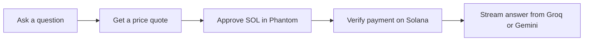
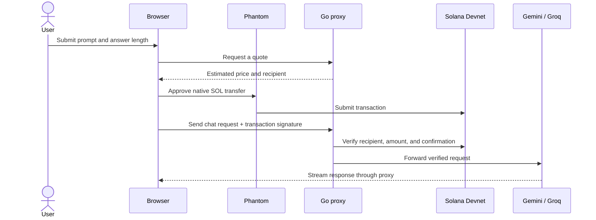

<p align="center">
  
</p>

<h1 align="center">⚡ PromptSOL</h1>
<h3 align="center">Pay-per-request AI on Solana</h3>

<p align="center">One prompt. One transparent quote. One on-chain payment. One streamed AI answer.</p>

<p align="center">
  
  
  
  
</p>

<p align="center">
  <a href="https://youtu.be/T9LgiqpkvSE?si=yln21xZDjIW0Xpsp">🎥 Demo video</a>
  &nbsp;·&nbsp;
  <a href="https://youtu.be/nSKqAEGPXvM?si=xXWSIOS6mS397jxw">🎤 Pitch video</a>
  &nbsp;·&nbsp;
  <a href="https://powerpoint.cloud.microsoft/open/onedrive/?docId=spo_nzrlndcxzwetyweyny00yzu4lwezm2utythlmdcxytaymmrjlgqwmje2zmjhltdkzjatndbhnc1hodazltk1yjk5nda3otu3miwyodm3ztmzmc1hzduyltq5mzqtowe1zc1hnti0yjfhzwyzzja_01fkd7wetwjq2nm5cc35byvcdk2zdf4x4p&driveId=E3E431D85B91B8BF&wdOrigin=APPHOME-WEB.DIRECT%2CAPPHOME-WEB.JUMPBACKIN-OCDI&wdPreviousSession=84e9faf9-52fd-4cc9-9425-79d5bfce8a76&wdPreviousSessionSrc=AppHomeWeb&ct=1791394298911">📊 PowerPoint presentation</a>
  &nbsp;·&nbsp;
  <a href="#how-it-works">⚙️ How it works</a>
  &nbsp;·&nbsp;
  <a href="#run-it-locally">🚀 Run locally</a>
</p>

---

## 💡 Executive summary

PromptSOL is a pay-per-request AI proxy built on Solana. It gives users an upfront, token-based price estimate, verifies a one-time SOL payment on Devnet, and streams an answer from Groq or Gemini. No subscription or account is needed.

## 🧑‍⚖️ The demo flow

| 1 · Ask | 2 · See the price | 3 · Approve | 4 · Get the answer |
|---|---|---|---|
| Enter a question and choose Quick, Balanced, or Detailed. | The quote updates before payment, based on the prompt and answer length. | Confirm one native SOL transfer in Phantom on Devnet. | PromptSOL verifies the transaction and streams the AI response. |

With `GROQ_API_KEY`, Groq is the primary provider and Gemini is the fallback. If Groq is unavailable, PromptSOL can switch providers using the same confirmed payment. Without a Groq key, requests go directly to Gemini.

## ✨ Why PromptSOL

- **Pay only when you ask.** Each AI request has its own price and payment.
- **Know the price first.** The quote is shown before Phantom opens.
- **Choose the answer depth.** Quick, Balanced, and Detailed have different output limits.
- **Watch the answer arrive.** Responses stream live from the active AI provider.

> **MVP scope:** Solana Devnet and test SOL only. Token counts are estimates, and the chosen output allowance is charged upfront. PromptSOL uses a custom HTTP 402 payment flow; it is not yet a full implementation of the x402 protocol.

## 🏗️ How it works



The Go proxy estimates the request price, verifies the transaction recipient and amount, prevents signature reuse within its running process, then forwards the paid request to the AI provider.

---

## 🖥️ Screenshots

<p align="center">
  
</p>

<details>
  <summary>See the request panel</summary>
  <p align="center"></p>
</details>

---

## Run it locally

You’ll need Docker Desktop, a Phantom wallet set to Solana Devnet, a Devnet recipient address, and a Gemini API key. Groq is recommended as the primary provider; Gemini is the fallback.

1. Copy `.env.example` to `.env`.
2. Set `SOLANA_WALLET_ADDRESS` and `UPSTREAM_API_KEY`. Optionally set `GROQ_API_KEY`.
3. Start the proxy:

   ```sh
   docker compose up --build -d proxy
   ```

4. Open [http://localhost:8080](http://localhost:8080), connect Phantom, and try a prompt. Use Devnet test SOL only.

## Deploy to Vercel

PromptSOL includes a Vercel container configuration in [`Dockerfile.vercel`](Dockerfile.vercel). Follow the [Vercel deployment guide](docs/VERCEL.md) to configure the container port and provider secrets. Keep the demo on Devnet; payment replay protection is currently stored in memory and is not shared across Vercel instances.

## For technical reviewers

<details>
  <summary>Architecture, pricing, API, and project limits</summary>

### Request flow



### Pricing model

The quote estimates input tokens from request size and adds the chosen output allowance. Default rates are 2,000 lamports per 1,000 estimated input tokens and 8,000 lamports per 1,000 output tokens, with a 1,000-lamport minimum. The full quote is paid upfront, even if the response is shorter than the allowance. The estimate is character-based, not the provider’s exact tokenizer.

| Mode | Approximate response | Output allowance |
|---|---:|---:|
| Quick | 70–100 words | 384 tokens |
| Balanced | 200–300 words | 1,024 tokens |
| Detailed | 450–650 words | 2,048 tokens |

### HTTP API

| Method | Endpoint | Purpose |
|---|---|---|
| `GET` | `/api/payment-info` | Returns the recipient and minimum charge. |
| `POST` | `/api/quote` | Estimates the price before payment. |
| `POST` | `/v1/chat/completions` | Verifies payment and streams the AI response. |
| `GET` | `/` | Serves the browser app. |

Paid chat requests include `X-Payment-Signature`. The proxy verifies the confirmed transfer and rejects signatures already used by the running process.

### Current limits and next steps

- Devnet only; no mainnet payment flow.
- Payment-signature replay protection is in memory and resets when the process restarts.
- No refund or partial settlement if generation uses less than the selected output allowance.
- The custom 402 flow is not canonical x402 yet.
- Next: persistent payment records, model-aware token counting, and focused payment/fallback tests.

### Configuration

| Variable | Required | Purpose |
|---|:---:|---|
| `SOLANA_WALLET_ADDRESS` | Yes | Devnet payment recipient. |
| `PORT` | No | HTTP listener port; set to `8080` for Vercel container routing. |
| `UPSTREAM_API_KEY` | Yes | Gemini API key, used as fallback when Groq is configured. |
| `GEMINI_MODEL` | No | Gemini fallback model. Defaults to `gemini-3.8-flash`. |
| `GROQ_API_KEY` | No | Enables Groq as the primary provider; without it, Gemini is primary. |
| `GROQ_MODEL` | No | Groq model. Defaults to `openai/gpt-oss-20b`. |
| `PAYMENT_LAMPORTS` | No | Minimum request charge. |
| `INPUT_LAMPORTS_PER_1K_TOKENS` | No | Estimated input rate. |
| `OUTPUT_LAMPORTS_PER_1K_TOKENS` | No | Output allowance rate. |
| `SOLANA_RPC_URL` | No | Solana transaction verification endpoint. |

See [`.env.example`](.env.example) for defaults and all options. Never commit `.env`, wallet keypairs, or API keys.

### Project map

```text
cmd/proxy/       Go HTTP server and embedded browser app
internal/        Configuration, quotes, payment checks, and provider routing
assets/          README screenshots and logo
demo/            Optional command-line demo client
```

Read the [architecture notes](docs/ARCHITECTURE.md), [security notes](docs/SECURITY.md), and [contribution guide](CONTRIBUTING.md). The Go packages compile, but there are currently no dedicated Go unit-test files.

</details>

---

<p align="center"><strong>PromptSOL — pay for the answer you need.</strong></p>
