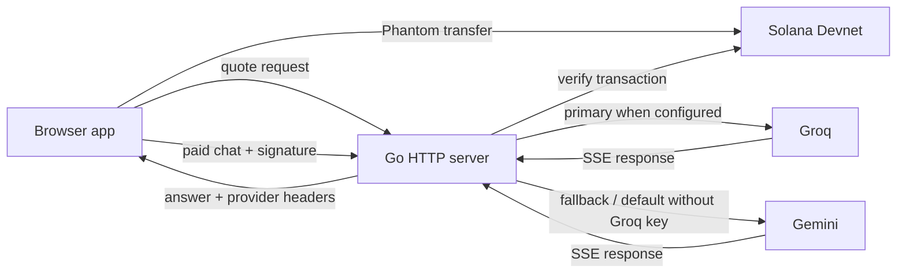

# Architecture

PromptSOL is a small Go HTTP server with an embedded browser client. The server owns price calculation, transaction verification, replay protection, and provider failover. The browser is responsible for wallet interaction and presenting the streamed answer.

## Components

## Request lifecycle

1. The browser sends its chat-completions payload to `POST /api/quote`.
2. The proxy estimates the input size, includes the selected output allowance, and returns the price and recipient address.
3. Phantom submits a native SOL transfer on Devnet. The browser waits for confirmation.
4. The browser sends the same payload to `/v1/chat/completions` with `X-Payment-Signature`.
5. Payment middleware recalculates the required amount from the request body and asks the Solana RPC to verify the signature, recipient, amount, and confirmation.
6. The in-memory cache claims the signature so it cannot unlock a second request.
7. When `GROQ_API_KEY` is configured, the proxy sends requests to Groq first and uses Gemini as a fallback. Without Groq, Gemini is used directly. It retries transient availability errors before switching providers.
8. The server streams the response to the browser and marks the provider and model with `X-AI-Provider` and `X-AI-Model`.

Requests to the paid endpoint without a signature receive HTTP 402. The browser UI uses the quote endpoint before payment rather than relying on that challenge response.

## Pricing calculation

The quote estimator reads the serialized chat messages and tool definitions, estimates input tokens with a character-based heuristic, and adds the requested output-token budget. It calculates input and output cost at their configured per-1,000-token rates, rounds each component up to a whole lamport, and applies `PAYMENT_LAMPORTS` as a minimum.

The same function is used by the public quote endpoint and payment middleware. This keeps the displayed quote and server-side requirement consistent for the same request body. It is still an estimate, not the AI provider's tokenizer or post-generation usage report.

## State and retries

- Payment signatures are held in a bounded in-memory LRU set. A process restart clears it.
- A signature is released when a failed upstream request returns an HTTP error, allowing the app to retry without another transfer.
- Successful signatures stay claimed and cannot be reused.
- Provider fallback reuses the already verified request and does not ask for another payment.
- There is no response cache or semantic cache.

## Protocol scope

The current payment flow uses a custom `X-Payment-Signature` header and a native SOL transfer. Although the proxy uses HTTP 402 for unpaid chat requests, it does not currently implement the canonical x402 payment headers or payload schema.
